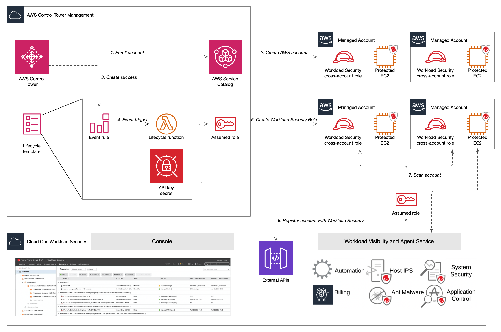

# Cloud One Workload Security Control Tower lifecycle implementation guide

[Cloud One Workload Security] helps you to detect and protect against malware,
exploitation of vulnerabilities, and unauthorized changes to your Windows and
Linux systems as well as containers.

[cloud one workload security]: https://cloudone.trendmicro.com

This guide provides details on how to integrate provisioning of Cloud One
Workload Security with [AWS Control Tower] to ensure that every account added
through Control Tower Account Factory is automatically provisioned in Workload
Security, providing centralized visibility to the security posture of Amazon
Elastic Compute Cloud (EC2) instances deployed in each account as well as the
foundation for policy and billing automation.

This solution can also be leveraged to manage AWS account provisioning for
customer-managed instances of Deep Security Software. See the
[Deep Security Software Deployments](#deep-security-software-deployments)
section for additional guidance.

[aws control tower]: https://aws.amazon.com/controltower/

## Overview

This Lifecycle Hook solution provides an AWS CloudFormation template which, when
launched in the Control Tower Management Account, deploys AWS infrastructure to
ensure Workload Security monitors each Account Factory AWS account
automatically.

The solution consists of one AWS Lambda function that manages a cross-account
role for Workload Security in each Managed Account and enrols each account with
Workload Security. AWS Secrets Manager is used to store the API key for Workload
Security in the Management account, and an Amazon EventBridge rule is configured
to trigger the lifecycle function when a Control Tower account is successfully
deployed.



### Usage

You will first need to [generate an API key for Workload Security]. Once you've
created the API key, log into the Control Tower Management account and [launch
the lifecycle template]. Select the AWS region for your Control Tower deployment
before entering the Workload API key and completing the launch stack wizard.

On the last page of the wizard, be sure to select the checkbox to acknowledge
that this template may create IAM resources.

Once the stack creation is complete, work with application teams to automate
[agent installation] and activate protection.

[generate an api key for workload security]:
  https://aws.amazon.com/controltower/
[launch the lifecycle template]:
  https://us-east-1.console.aws.amazon.com/CloudFormation/home?region=us-east-1#/stacks/create/review?templateURL=https://aws-quickstart-us-east-1.s3.amazonaws.com/quickstart-ct-trend-micro-cloud-one-workload-security/templates/Trend-Micro-Cloud-One-Workload-Security-LifeCycle-QS.yaml&stackName=WorkloadSecurityLifeCycleHook
[agent installation]:
  https://help.deepsecurity.trendmicro.com/agent-install.html

### Implementation

During stack launch, the lifecycle Lambda function will be invoked for each
existing Control Tower Account, including the Control Tower Management, Audit,
and Log accounts. After launch, an Amazon EventBridge event rule will trigger
the lifecycle function for each successful Control Tower `CreateManagedAccount`
event. The lifecycle function will retrieve the Workload Security ApiKey from
AWS Secrets Manager, then get the External ID for your organization from the
Workload Security API. Next the function will assume the `ControlTowerExecution`
role in the target Managed Account in order to create the necessary
cross-account role and associated policy. Finally, a call will be made to the
Workload Security API to add this Managed Account to your Workload Security
tenant.

### Upgrade

As new capabilities are added to Workload Security, it may be necessary on
occasion to update the permissions for the application's cross-account role. To
update the role deployed by the lifecycle hook, update the Workload Security
stack with the latest template, which can be found
[here](https://aws-quickstart-us-east-1.s3.amazonaws.com/quickstart-ct-trend-micro-cloud-one-workload-security/templates/Trend-Micro-Cloud-One-Workload-Security-LifeCycle-QS.yaml "Download link").
The parameter values should not be modified from their original values unless
directed by Trend Micro Support. Updating the CloudFormation stack will update
the role used by all existing accounts and the role created for future
enrollments.

### Removal

To remove the Control Tower lifecycle hook, identify and delete the
CloudFormation stack. Protection for Managed Accounts which have already been
added will remain in place. See the Workload security documentation for details
on
[removing an AWS account from Workload Security](https://cloudone.trendmicro.com/docs/workload-security/aws-account-manage/#Remove).

If you would like to remove all of the protection for managed accounts, you can
send a `remove_all` invocation event to the lifecycle hook before deleting the
CloudFormation stack.

#### How to send the `remove_all` event via the AWS console

1. Log in to the AWS console for your organization's Control Tower Management
   account.

2. Open the CloudFormation console.

3. Find the `WorkloadSecurityLifeCycleHook` stack and open the `Resources` tab.

4. Find the `LifecycleEventHandler` row. It will have a `Type` value of
   `AWS::Lambda::Function` and there will be a link to the function. Click the
   link to open the Lambda console for the function.

5. In the Lambda function console, open the `Test` tab and create a new event
   with the event payload below:

   <details>
   <summary>Event payload</summary>

   ```json
   {
     "InvokeAction": "remove_all"
   }
   ```

   </details>

6. Click `Invoke` to trigger the lifecycle hook with the `remove_all` event
   payload.

You can verify that removal has been triggered for each account in your
organization by reviewing the output logs.

#### How to send the `remove_all` event via the AWS command-line interface

1. Get the lifecycle Lambda function name:

   ```sh
   aws cloudformation describe-stack-resources \
      --stack-name WorkloadSecurityLifeCycleHook \
      --query 'StackResources[?LogicalResourceId==`LifecycleEventHandler`].PhysicalResourceId' \
      --output text
   ```

2. Invoke the lifecycle Lambda function, replacing `FUNCTION_NAME` with the name
   from the previous step:

   ```sh
   aws lambda invoke \
      --function-name FUNCTION_NAME \
      --log-type=Tail \
      --payload $(echo '{"InvokeAction":"remove_all"}' | base64) \
      --query LogResult \
      --output text \
      remove_all.log | base64 -d
   ```

You can verify that removal has been triggered for each account in your
organization by reviewing the output logs.

### Deep Security Software Deployments

Some organizations may choose to host the Deep Security Software solution which
manages agent policy and protection into their own AWS account instead of using
the hosted solution. This product is available in a pay-as-you-go or
bring-your-own-license model from the [AWS Marketplace]. Trend Micro recommends
deploying the [Deep Security Quickstart] into your Control Tower Security
account and either leveraging a public facing Elastic Load Balancer in the
QuickStart deployment, or configuring [AWS PrivateLink] to create connectivity
between Managed Accounts and the Deep Security Manager console.

[aws marketplace]:
  https://aws.amazon.com/marketplace/pp/Trend-Micro-Trend-Micro-Deep-Security/B01AVYHVHO
[deep security quickstart]:
  https://s3.amazonaws.com/awsmp-fulfillment-cf-templates-prod/d70fb77f-c90c-40e9-8cba-2d257a7b01d2.a79962c7-5e92-42f7-6484-e9ed7afcd8f6.template
[aws privatelink]: https://aws.amazon.com/privatelink/

## Self-hosting

Some customers may wish to self-host the Quick Start content; one popular reason
for doing so is to ensure that the code you have reviewed is the code you
deploy.

If you want to self-host this Quick Start, you will need to:

1. Create a bucket in the region where your AWS Control Tower is deployed. The
   bucket can be owned by any account as long as your Control Tower management
   account can access the content.

   > :rotating_light: WARNING: If your bucket is not in the same region where
   > your AWS Control Tower is deployed, the stack deployment will fail.

2. Copy the
   [CloudFormation template](https://aws-quickstart-us-east-1.s3.amazonaws.com/quickstart-ct-trend-micro-cloud-one-workload-security/templates/Trend-Micro-Cloud-One-Workload-Security-LifeCycle-QS.yaml)
   into your bucket. We recommend using the key
   `quickstart-ct-trend-micro-cloud-one-workload-security/templates/Trend-Micro-Cloud-One-Workload-Security-Lifecycle-QS.yaml`.

3. Copy the
   [Lambda function deployment package](https://aws-quickstart-us-east-1.s3.amazonaws.com/quickstart-ct-trend-micro-cloud-one-workload-security/functions/packages/c1ws-controltower-lifecycle.zip)
   into your bucket. You can choose your own prefix, but the object path must
   end in `functions/packages/c1ws-controltower-lifecycle.zip`. We recommend
   that you use
   `quickstart-ct-trend-micro-cloud-one-workload-security/functions/packages/c1ws-controltower-lifecycle.zip`.

   > :information_source: TIP: You can use the AWS command-line interface to
   > copy the content:
   >
   > ```sh
   > aws s3 cp --recursive \
   >   s3://aws-quickstart-us-east-1/quickstart-ct-trend-micro-cloud-one-workload-security \
   >   s3://your-bucket/quickstart-ct-trend-micro-cloud-one-workload-security
   > ```

4. Review the content following your organization's practices. You may want to
   read through the details of the CloudFormation stack to see exactly what it
   creates and what properties each resource has, and you may want to read
   through the source code for the Lambda function to see what it does.

5. Launch the CloudFormation stack in the same region where your AWS Control
   Tower is deployed, providing the URL to the template. In the parameters,
   replace the default value for the **Quick Start S3 bucket name** and the
   **Quick Start S3 key prefix** with the name of your bucket and the prefix
   within the bucket where the content is stored. In the examples above, the
   prefix is the default,
   `quickstart-ct-trend-micro-cloud-one-workload-security/`.

   > :rotating_light: WARNING: If you deploy the stack in a different region
   > than your AWS Control Tower, the lifecycle function will not receive events
   > when new accounts are created or removed and will not automatically add or
   > remove accounts in Workload Security.

.
