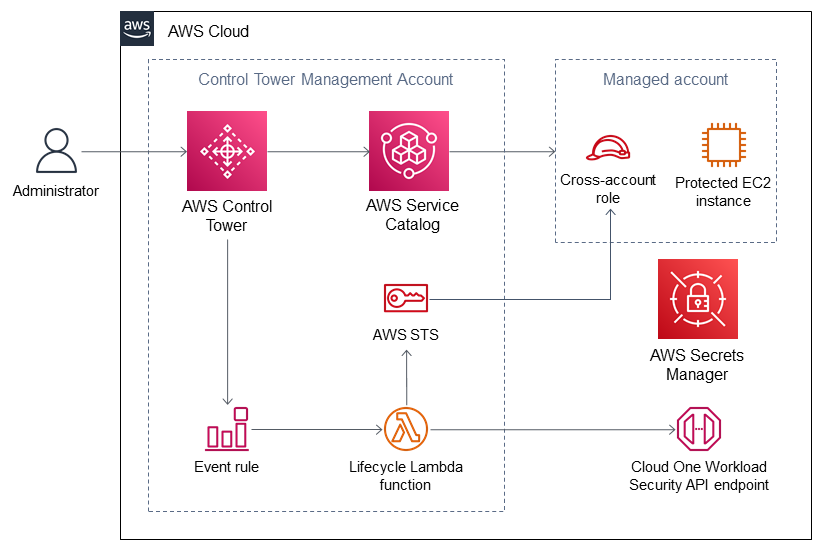

:xrefstyle: short

Deploying this Quick Start with default parameters builds the following {partner-product-name} environment on the AWS Cloud.

// Replace this example diagram with your own. Follow our wiki guidelines: https://w.amazon.com/bin/view/AWS_Quick_Starts/Process_for_PSAs/#HPrepareyourarchitecturediagram. Upload your source PowerPoint file to the GitHub {deployment name}/docs/images/ directory in this repo. 

[#architecture1]
.Quick Start architecture for _{partner-product-name}_ on AWS

* An administrator enrolls new or existing AWS accounts in AWS Control Tower.
* AWS Control Tower invokes AWS Service Catalog to create a managed account and generates an Amazon EventBridge event rule.
* The managed account contains a cross-account role that the management account can assume through AWS Security Token Service (AWS STS).
* An Amazon Elastic Compute Cloud (Amazon EC2) instance in the managed account is not created as part of the Quick Start. It represents any workload instances that are protected by this Quick Start deployment.
* The Amazon EventBridge event rule invokes a lifecycle Lambda function, which creates a new AWS account role through an AWS STS resource. The Lambda function also creates a new Workload Security endpoint.
* AWS Secrets Manager stores the API keys to authenticate with the Cloud One endpoint.